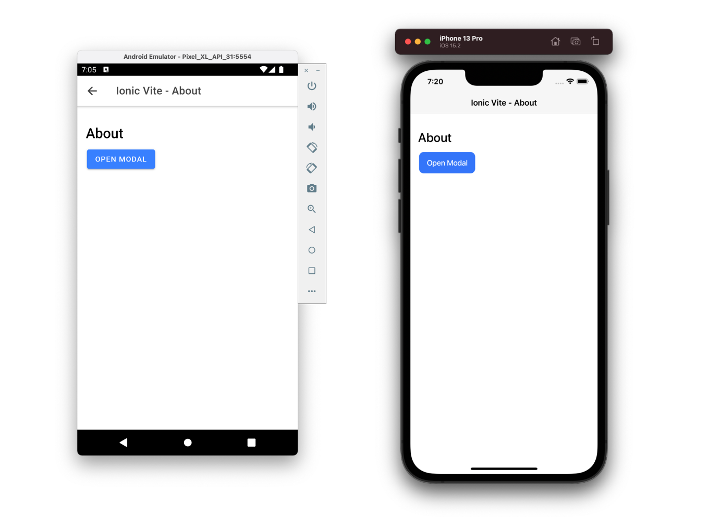

# Clean monorepo Template with Vue, Ionic, and Capacitor

<center> 

</center>

- Ionic 8
- Vue 3.4
- Capacitor 6
- Typescript 5.5

## Installation

```bash
pnpm install
```

## Development HMR

Go to app folder `cd ./packages/app` and run the following command:

```bash
# pwa
pnpm dev

# ios
pnpm ionic cap run ios

# android
pnpm ionic cap run android
```

## Build

```bash
pnpm build
```

## Documentation

- [vue docs](https://v3.vuejs.org/guide/introduction.html)
- [ionic docs](https://ionicframework.com/docs/components)
- [capacitor docs](https://capacitorjs.com/docs)

## Recommended IDE Setup

[VSCode](https://code.visualstudio.com/) + [Vue - Official](https://marketplace.visualstudio.com/items?itemName=vue.volar)

## License

[MIT](./LICENSE) License © 2021-Present [reslear](https://github.com/reslear)
