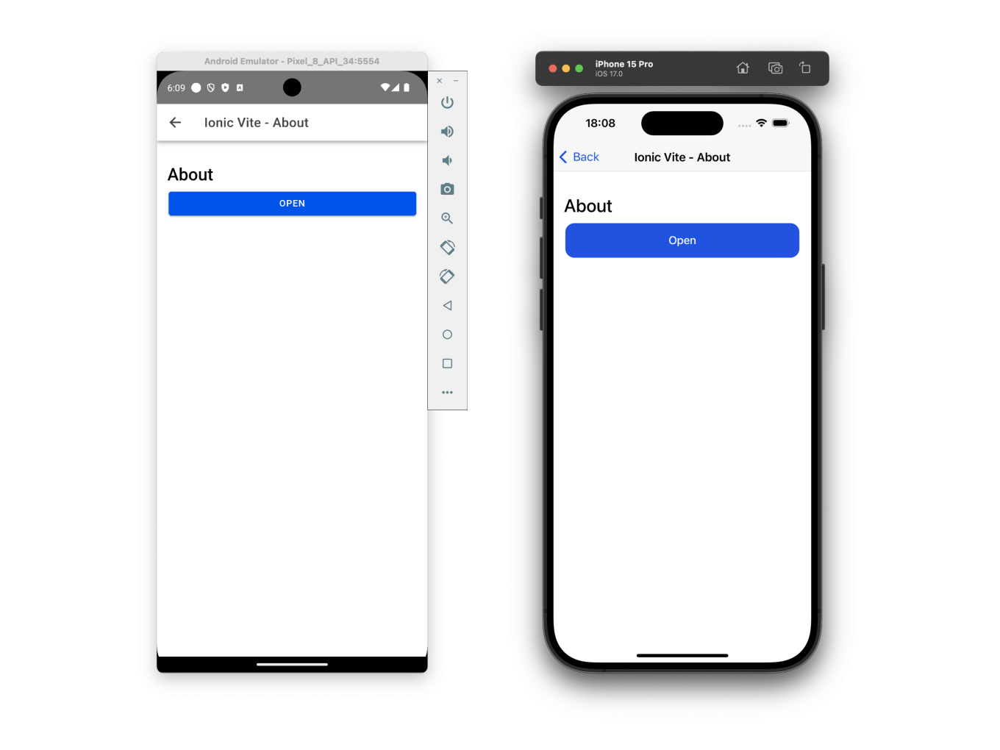

# Getting Started with ViteJS, Ionic Framework v6 And VueJS

[ionic docs](https://ionicframework.com/docs/components)

## Recommended IDE Setup

[VSCode](https://code.visualstudio.com/) + [Vue Language Features (Volar)
](https://marketplace.visualstudio.com/items?itemName=vue.volar)

## License

[MIT](./LICENSE) License © 2021-Present [reslear](https://github.com/reslear)
